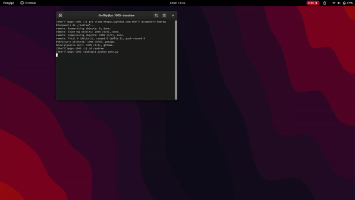

  [](https://opensource.org/licenses/MIT)    
# RanDraw

Example of using the "turtle" library for drawing, in this example we are using the "turtle" library for drawing random shapes.

## Installation

```cmd
git clone https://github.com/TheFilipcom4607/RanDraw.git
```

## Usage

```python
# go to RanDraw Folder
cd RanDraw

# install requirements
pip install -r requirements.txt

# run the RanDraw
python main.py 
```
RanDraw will generate a random shape, to generate new shape just click "q" key.
To exit press "esc" key.

## Demo
 


## Contributing

Pull requests are welcome. For major changes, please open an issue first
to discuss what you would like to change.

Please make sure to update tests as appropriate.

## License

[MIT](https://choosealicense.com/licenses/mit/)
